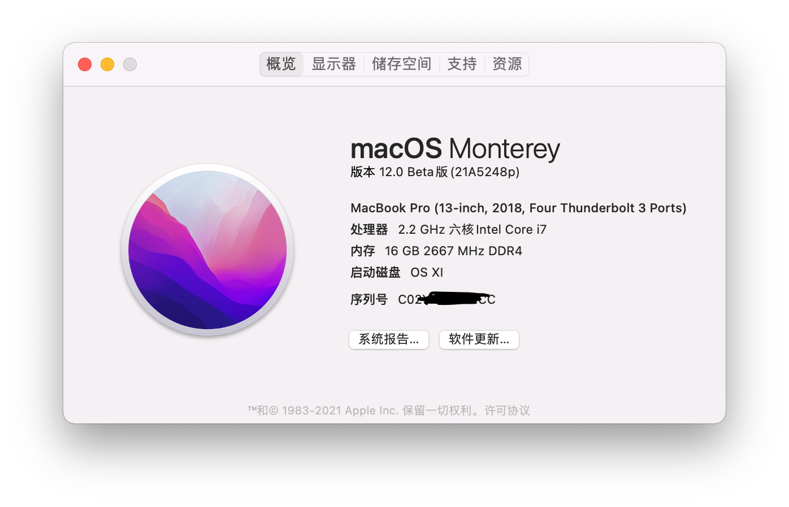
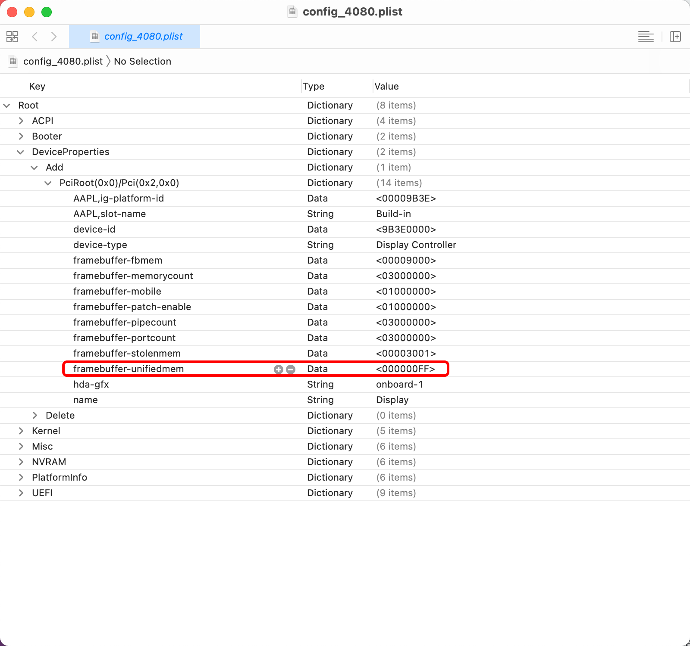
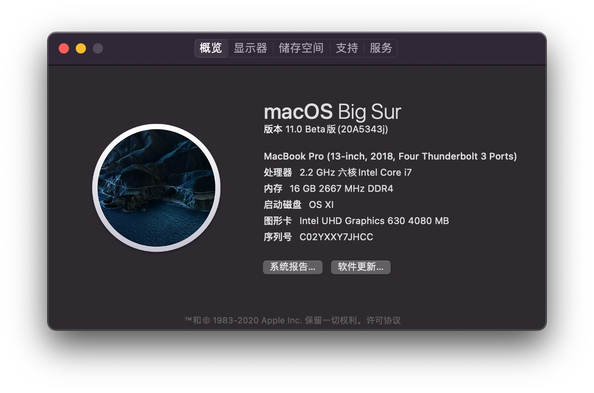
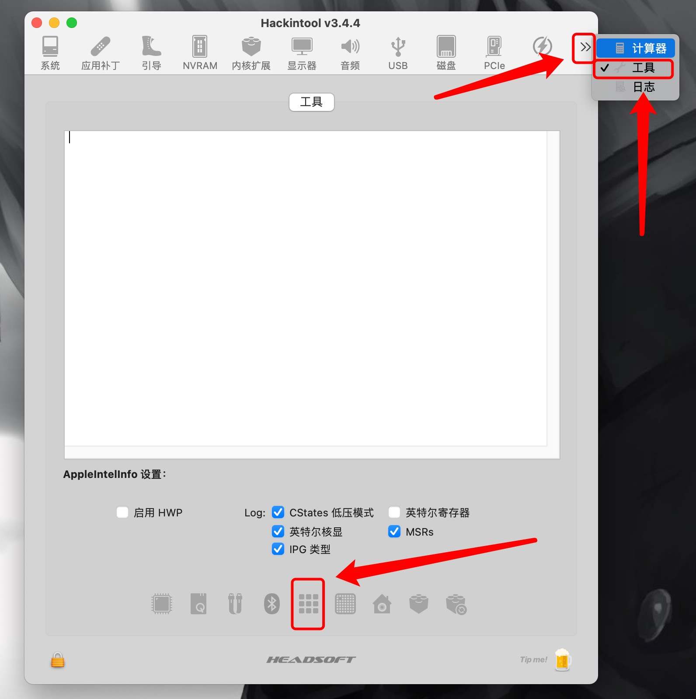
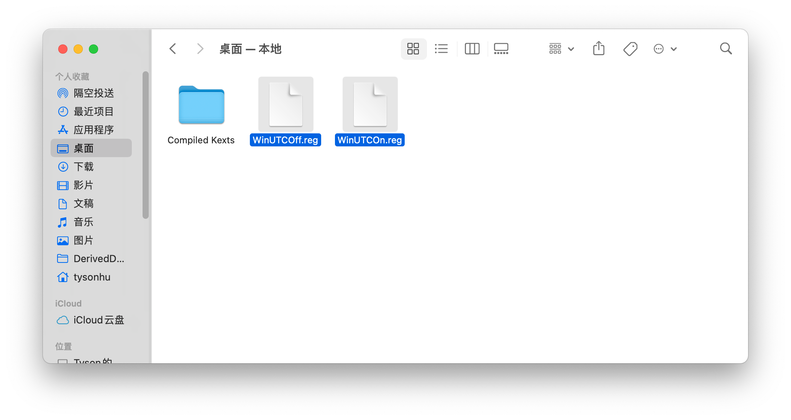

# Razer Blade 15 Base Hackintosh
<a href="https://github.com/Mother-FKR/RazerBlade15-Base-Model-Hackintosh_macOS_Big_Sur/issues">  </a>
<a href="https://github.com/Mother-FKR/RazerBlade15-Base-Model-Hackintosh_macOS_Big_Sur/blob/master/LICENSE">  </a>
<a href="https://github.com/Mother-FKR/RazerBlade15-Base-Model-Hackintosh_macOS_Big_Sur/commits/master">  </a>

<a href="https://www.apple.com/macos/monterey-preview/"></a>

特别鸣谢：   
- [Dortania](https://dortania.github.io) - 黑苹果安装向导（OpenCore）
- [Acidanthera](https://github.com/acidanthera) - OpenCore以及核心kext全家桶
- [RehabMan](https://github.com/RehabMan) - ACPI的关键修补
- [doanhmaple](https://github.com/doanhmaple) - ACPI电池修补🔋 & 雷电三修补⚡️
- [EmeryWan](https://github.com/EmeryWan) - BIOS修改 & 系统设置

**支持macOS：10.15.1 ～ 12.0 Beta ｜ [变更目录](https://github.com/Mother-FKR/RazerBlade15-Base-Model-Hackintosh_macOS_Big_Sur/blob/master/Changelog.md)**     
**暂无bug，期待你们的反馈<3**    


**⚠️：本人不会为你操作过程中所出现的任何错误负责！**   

<a href="https://github.com/acidanthera/OpenCorePkg">  </a>
<a href="https://github.com/Mother-FKR/RazerBlade15-Base-Model-Hackintosh_macOS_Big_Sur/releases/tag/v2.1.0">  </a>
<a href="https://github.com/Mother-FKR/RazerBlade15-Base-Model-Hackintosh_macOS_Monterey/releases/tag/v2.1.2.822-beta">  </a>
<a href="https://github.com/Mother-FKR/RazerBlade15-Base-Model-Hackintosh_macOS_Big_Sur/archive/master.zip">  </a>

EFI支持以下这些安装：      
1.OTA 2.完整安装包 3.U盘安装 4.虚拟机     
**建议从左往右尝试，最后再尝试我后面写的关于虚拟机安装教程！**                          

稳定版采用 `OpenCore 0.7.2`，测试版EFI采用 `OpenCore 0.7.3`。


#### 关于这篇文章 & 交流
由于我需要同时兼顾我的大学课程和博客，在后续的时间我将降低我的更新频率，学业为重希望大家理解，不过我也向大伙们保证不会停更的（日更我肯定是肝不动了，毕竟👴每周都要做Lab Report，因此我尽量保持~~周更~~暑假前有空尽量更新嘿嘿。） 

如果你安装的时候遇到一些困难或者有什么不懂的地方，可以尝试找个QQ群进行交流？我在这个群里➡️ "[OpenCore技术交流群](https://shang.qq.com/wpa/qunwpa?idkey=665ed002721454d2e811535020261a04b0aae2fa3b6a2ffde5778a852f892178)"，大神众多非OC适配者慎入.

## 目录 / Contents
- [文件说明 / File Description<sup>*</sup>](#文件说明--file-description)
- [写在最前 / Preface](#写在最前)
- [基础配置 & 知识 / Helpful resourses<sup>*</sup>](#基础配置--知识)
- [更新 / Updates](https://github.com/Mother-FKR/RazerBlade15-Base-Model-Hackintosh_macOS_Big_Sur/blob/master/Update.md)
- [一些问题 / Issues](#一些问题)
- [硬件介绍 / Device Spec](#1硬件介绍)
- [最终效果 / About Mac](#2最终效果)
- [解锁BIOS / BIOS Unlock](#3解锁bios)
- [安装前的准备 / Before install](#4安装前的准备)
- [系统安装 / System instation](#5系统安装)
- [一些优化 / Optimization](#6一些优化)
- [附加：U盘直装 / Flash Drive instation](#7附加u盘直装)
- [参考 / Reference](#8参考)

<sup>*</sup> Means it / parts of it has English.

## 文件说明 / File Description  
- **CLOVER**
  - `CLOVER`引导`EFI`，版本`5103`，对应系统 `macOS 10.15.4`。由于我已经转入 `OC` 引导，因此不会再进行更新，放在这里只是为了给那些需要使用 `5120` 及以上的人作为参考
  - EFI with `CLOVER`，`v5103`, for `macOS 10.15.4`. I won't update it anymore,because of I move to `OC`. Just a reference for guys who want to use `CLOVER v5120` or upper verion.
  - 问题：无问题  / Issue: None

- **EFI beta**  (使用时记得改名为 `EFI`)
  - `OpenCore` 版本的EFI，版本 `0.7.3`，对应系统 `macOS 12`。该版本的EFI更新频率较高（更新比较激进，基本对应最新自编译 `Kext` 和 `OpenCore`）因此很容易出现一些BUG。喜欢尝鲜的可以使用。
  - EFI with `OpenCore` , `v0.7.3`,for `macOS 12`. Update with High Freq (**Lastest `Kext`[Self Compile] & `OpenCore`[Self Compile]**)which could cause some **ISSUE** that don't expect.
  - **问题：**
    - **包含`EFI`里所有的BUG**
    - **可能会有其他未知BUG**
  - **Issue:**
    - **Contain all BUG in `EFI`**
    - **Might have other unknow BUG**

- **EFI** 
  - `OpenCore` 版本的EFI，版本 `0.7.2`，对应系统 `macOS 12` & `macOS 11` & `macOS 10.15.6`。较为稳定的EFI，只有在确认稳定后才会进行更新，因此更新频率不是很高。
  - EFI with `OpenCore` , `v0.7.2`, for `macOS 12` & `macOS 11` & `macOS 10.15.6`. `Stable Version` of EFI, Only update while it's stable to use. Thus not too high freq.
  - **问题：**
    - **睡眠唤醒后时间仍定格在睡眠前（需手动更新时间），确认为RTC问题，短期无时间去解决，有空的小伙伴希望可以帮帮我5555** 
    - **无法自动切换音频输出，开机默认耳机输出，变更输出需要手动切换。(无法解决)**
  - **Issue:**
    - **Time Freeze while laptop sleep, That means you have to MANUALLY update the time after sleep. Issue confirmed: RTC, but I don't have time to fix it before the winter break. If you want help me to fix this, that helps a lot <3**
    - **Can't switch audio output automatically. You have to MANUALLY switch it(Can't solve)**

- **Tools**
  - 里面包含该教程需要的基本工具（软件）。
  - Include some necessary / basic `tools` for this tutorial

- **Wallpaper**
  - 我备份的壁纸。。。
  - Just `Wallpaper`

- **image**
  - 本教程所包含的图片的缓存，对于你们来说并没有什么用
  - `image caches` for this tutorial, `useless` to your guys.

- **Changelog**
  - 关于Releases上的变更目录。
  - Changelog for releases.


## 写在最前
- 本文的内容主要参考了[EmeryWan](https://github.com/EmeryWan)的文章[“雷蛇灵刃15黑苹果”](https://github.com/EmeryWan/Razer-Blade-15-2018-Base-Hackintosh)作为入门黑苹果的教程（该文章采用了Clover的引导），[Razer Blade 15 Base Model Hackintosh](https://github.com/blade15basehackintosh)的文章["razerbladehackintosh"](https://github.com/blade15basehackintosh/razerbladehackintosh)作为OC（OpenCore）引导转换的参考文档，以及[doanhmaple](https://github.com/doanhmaple)的文章[“Razer-Blade-15-Advanced-2018-Hackintosh”](https://github.com/doanhmaple/Razer-Blade-15-Advanced-2018-Hackintosh)对ACPI的电池修补工作的patch帮助。这里再次感谢他们对安装黑苹果的分享和付出（Big thanks for [EmeryWan](https://github.com/EmeryWan), [Razer Blade 15 Base Model Hackintosh](https://github.com/blade15basehackintosh) and [doanhmaple](https://github.com/doanhmaple)!!!)。如果你还需要更多关于黑苹果安装以及优化的教程，可以前往[黑果小兵的部落阁](https://blog.daliansky.net/)和[Hackintosh黑苹果长期维护机型EFI及安装教程整理](https://github.com/daliansky/Hackintosh)查看，里面有很多杂七杂八的机型配置和安装教程以及一些实用的黑苹果优化。
- 跟很多人一样，我开始接触黑苹果这个领域是因为macOS的流畅与稳定性，对码农更友好的unix内核和好看的系统UI。再者由于新冠疫情的影响，我被迫长时间拘留在家中实在无聊🥱，并且找到了很多相同机型的教程，这大大减少了入门黑苹果的难度。
- ~~如果你只想寻求稳定的macOS，建议你前往文章开头的那些文章查看（macOS 10.15）~~(经过这么多版本的迭代，macOS 11 现在也可以稳定使用)，**⚠️这里我只会讲解关于macOS 11 的安装⚠️** ，当然如果你希望充分利用你的显卡（例如GTX1060，GTX1070，GTX960，GTX980等20系之前的英伟达显卡[**RTX系列：RTX2060，RTX2060 SUPER，RTX2070，RTX2070Ti，等类似显卡均不可用 🚫** ]），你可以尝试安装macOS 10.13（High Sierra是支持英伟达显卡的最新的版本，在此之后只能运行你的IGPU，也就是英特尔的集成显卡），请自行爬贴查找教程。
- **本文并不会讲解关于OC配置的问题，我相信既然你想升级 macOS Big Sur ，那么你应该具有一定的OC基础知识，再者由于机型的不同大家的OC也都不大一样，这里很难进行细说。如果你真的是新手并且想尝试新系统，那我也不建议你进行操作，首先新系统的bug有很多，它并不是理想的macOS，其次各种驱动和插件对于 macOS Big Sur 都还在测试阶段并不稳定，如果哪里出了问题，一个新手很难去解决。**
- 看到这里如果你真的打算继续安装macOS 11。那么建议你最好更换为博通的网卡进行使用，USB网卡和英特尔网卡驱动在11里仍然存在众多问题，~~现无法在11里运行~~ (USB网卡现在可以使用，但需要关闭SIP)。
- **同机型或者相似机型的同学们可以参考我的efi，当然在你使用我的efi的时候记得更改里面的三码（我忘改了😭），以免造成设备冲突！**

## 基础配置 & 知识
由于许多核心Kext都对CLOVER引导停止了维护，OpenCore已经逐渐成为主流，建议尽量对后者进行 研究 / 制作 引导，以适应未来的场景。

- CLOVER
  - [Razer Blade 15 Base Model (2018) [Clover] [10.15.3 / Catalina]](https://github.com/EmeryWan/Razer-Blade-15-2018-Base-Hackintosh)
  - [Razer Blade 15 Advanced Model (early-2019) [Clover] [10.14 / 10.15]](https://github.com/stonevil/Razer_Blade_Advanced_early_2019_Hackintosh) [英文 / English]
  - [Razer Blade 15 Avdanced Model (2018) [Clover] [10.13 / High Sierra]](https://github.com/stonevil/Razer_Blade_Advanced_early_2019_Hackintosh) [英文 / English]
- OpenCore
  - [Razer Blade 15 Base Model (2018) [OpenCore] [10.15.4 / Catalina]](https://github.com/blade15basehackintosh/razerbladehackintosh) [英文 / English]
  - [Razer Blade 15 Advanced Model (2018) [OpenCore] [10.15.5 / Catalina]](https://github.com/doanhmaple/Razer-Blade-15-Advanced-2018-Hackintosh) [英文 / English]
- OpenCore向导
  - [vanilla-laptop-guide](https://dortania.github.io/vanilla-laptop-guide/) [英文 / English]
  - [使用OpenCore引导黑苹果](https://blog.xjn819.com/?p=543)
  - [精解OpenCore](https://blog.daliansky.net/OpenCore-BootLoader.html)
  - [从Clover到OpenCore](https://blog.daliansky.net/From-Clover-To-OpenCore.html)
  - [【持续更新】OpenCore引导-v各种卡及OC引导常见问题解决方案速查表合集](http://imacos.top/2020/03/28/0154/) 
- **其他机型的EFI（不会配的或者想要现成的看这里！）**
  - [Hackintosh黑苹果长期维护机型EFI及安装教程整理](https://github.com/daliansky/Hackintosh)
- [OpenCore 检查工具 / OpenCore Sanity Checker](https://opencore.slowgeek.com/)
  - 用于检测你config是否有配置错误，里面提供的信息仅供参考，并非 100% 正确！
  
*以上所有的文章均为 搬运 / 转载 如果觉得有用，可以打赏原作者 **（我不是原作者！！！）***


## 一些问题
我也是刚接触黑苹果不久，到我写这篇文章才一个多月？ 还有很多问题是我无法解决的，当然我后面也会努力爬贴查找解决方案，毕竟 `macOS 11` 我不就是这么过来的嘛。如果有哪位大佬知道如何解决可以联系我，感激不尽！

- ~~与10.15的问题一样，睡眠后无法唤醒，开盖就只有黑屏，其他都正常运作~~  (已解决，现在可以直接关盖睡眠💤 )
- ~~无法进入Recovery  （直升无此问题，但这里并不会讲解直升，也许以后会？）~~  (具体解决方案请移步[[6-10修复Recovery无法进入](#6-10修复recovery无法进入)])
- ~~Wi-Fi老断~~  (更新AirportBrcmFixup)
- ~~直升系统导致Safari无法正常运行（过一会就闪退）~~
- ~~开机画屏~~  （显卡注入问题，UHD630 无需再注入显卡id）
- ~~电池无显示 & 电量始终为 0%  （具体解决方案请移步 [[6-3]电池修复](#[6-3]电池不显示) ）~~ [新版 `VirtualSMC` 已修复此问题，v1.1.5+]
- ~~触摸板可用但是设置偏好里找不到触摸板  （具体解决方案请移步 [[6-3]电池修复](#[6-3]电池不显示) ）~~ [新版 `VirtualSMC` 已修复此问题，v1.1.5+]
- ~~`sip` 无法关闭  （需要进入Recovery方可更改，据说直升无此问题）~~ (具体解决方案请移步 [[6-6]关闭 `SIP`](#6-6关闭-sip)
- ~~时间无法更改自定义设置~~ (`beta3` 已修复该错误)
- ~~蓝牙不可用~~ （已通过更换网卡解决）
- ~~USB网卡不可用~~ (`chris1111`现已更新USB网卡对macOS11的支持，**使用时需关闭 `SIP`!!!**)
- ~~状态栏卡顿~~   (具体解决方案请移步 [[6-4]状态栏卡顿](#[6-4]状态栏的卡顿) ）
- **新增：睡眠时，时间会定格在睡眠前的时候，唤醒后需手动同步时间。**
- **目前无解：无限实现自动切换音频输出，需手动进行切换**

    
## [1]硬件介绍
|        部件      |        型号         |                   最终情况                   |
| :----------: | :-----------------: | :------------------------------------------: |
|     CPU      |      Intel Core i7-8750H processor, 6 Cores / 12 Threads, 2.2GHz / 4.1GHz, 9MB Cache       |                     无问题（系统将采用UHD630作为显卡）                   |
|     IGPU     |        Intel UHD 630       |   无问题   |
|     GPU      |  Nvdia GTX1060 Max-Q   | 除 10.13 High Sierra 安装 WebDriver 外，10.13以上版本皆不可用（建议直接屏蔽掉） |
|      内存    |   16GB dual-channel DDR4-2667MHz, up to 64GB    |       无问题      |
|     硬盘     | 更换为 Sabrent Rocket NVMe 1TB          |                     无问题                     |
|     网卡     |       9560NGW （现已更换为DW1560 / BCM94352Z）             |           无问题（~~Windows驱动需要自己下载~~, 驱动已上传）            |
|    显示器    |        15.6" Full HD 60Hz, 1920 x 1080 IPS      |                无问题（可以在60Hz和48Hz之间切换）                     |
|    摄像头    |       HD webcam (1MP / 720P)              |                     无问题                     |
|    扬声器    |       Realtek ALC256              |                     无问题                     |
|    耳机    |           爱插啥就是啥                          |                     无问题                     |
|    麦克风    |                 鬼晓得啥型号                |                     无问题                     |
|    触控板    |            全玻璃                |             无问题                             |
|  HDMI 接口<sup>*</sup>   |                     |    直通显卡，除安装 High Sierra(或更低) 外不可用     |
| Mini DP 接口<sup>*</sup> |                     |    直通显卡，除安装 High Sierra(或更低) 外不可用     |
|    雷电3     |                     |   被识别成 USB3.1 ？？？（eGPU目前不确定，应该无法使用）  |
|    大小      |       17.8mm x 235mm x 355mm  |    这tm还能变？？？ | 
|    重量       |         2.21 Kg        |    还想变的更轻？别做梦了老铁     | 
|    电池      |    80Wh （好像是，我忘了，反正不耐用...)   |无问题（还能有问题 ？？？）    |
|    电源适配器  |       180W          | 没PD快充，当然你可以自己试试诱骗器    | 

<sup>*</sup>目前对于10.13(High Sierra) 以上的设备想要外接屏幕需要使用带有 `DisplayLink` 或与其相似技术支持的转接器(一般为HDMI/DP 转 USB-typeA), 或者使用支持 `Airplay` 的屏幕. (我会在近期测试这类转接器, 如果可行的话我会挂出链接以供参考)      

### [1-1]硬件更换 / 硬件升级
**网卡 & 蓝牙** 

| 网卡型号 | 描述 |
| ---: | :--- | 
| ``BCM94352Z (DW-1560)`` | 适配macOS 11，双天线，即装即用（用我EFI的话）。**Windows 10需要安装驱动才可使用！** | 
| ``BCM94360cs2`` | 双天线 + 免驱，但是需要自己另购买转接卡，据说2.4GHz WiFi 与 蓝牙有干扰 | 
| ``BCM94350ZAE(DW-1820a)`` | 黑果小兵推荐的网卡，在macOS 11中已不是免驱卡，需要自己打驱动补丁，并且需要屏蔽针脚，爱折腾的可以上 |
   

**固态硬盘**

| NVMe硬盘  | 4k 支持 | 描述  |
| ---: | :--- |  :--- | 
|  ``Samsung EVO 970 NVMe``  |   否  |  一个性能非常优秀的SSD，当然价格也非常的扎心，我知道买不起是我的问题，但是不支持4k使我劝退 |
|  ``Sabrent Rocket NVMe``  |   是  |   由`stonevil`大佬确认，外网许多评测都对该SSD的性价比表示认可，我也入手了该SSD，顺序读取3500MB/s  |
|  ``WD Black SN750 NVMe``  |   未知  |   没人测试过该SSD对4k的支持，不过性价比不错，性能略逊970  |
|  ``WD Black SN550 NVMe`` |  未知  |  750的低配，蓝盘温度相比黑盘温柔很多，当然性能也略低，性价比不错|
| ``Samsung PM981`` / ``Samsung PM981a``  |  否  |  皆为970系列的OEM版，无保不建议，据说安装系统也有一些问题，唯一的优点也就是便宜了  |

**内存条**[搬运自`stonevil`的帖子]

| 内存条型号 | 内存大小 | 内存频率 | 时序 | 亚马逊链接 | 消息来源 |
| ---: | :--- | :--- | :--- | :--- | :--- |
| ``Ballistix Sport LT 32GB`` | 2x16Gb | 2666 | CL16 | [Amazon](https://www.amazon.com/gp/product/B06XRBS4Y5/ref=ppx_yo_dt_b_asin_title_o03_s00?ie=UTF8&psc=1) | [stonevil](https://www.tonymacx86.com/members/stonevil.254235/) |
| ``Kingston Technology HyperX Impact 32GB`` | 2x16Gb | 2666 | CL15 | [Amazon](https://www.amazon.com/dp/B01NAL3TYY/?coliid=I3Q9P4ZU9V435H&colid=1ZGSQH2G88154&psc=1&ref_=lv_ov_lig_dp_it) | [Razer Blade 15 Advanced RAM upgrade](https://www.reddit.com/r/razer/comments/c1c9wl/razer_blade_15_advanced_ram_upgrade/) |
| ``Samsung 16GB DDR4 PC4-21300``  |  16Gb (需自己买两片) | 2666  |  CL19  | [Amazon](https://www.amazon.com/Samsung-PC4-21300-2666MHZ-SODIMM-laptop/dp/B07F6N8L3S/ref=sr_1_8?crid=1ZAJ4EFZ2FBQY&dchild=1&keywords=samsung+ram+32gb+ddr4&qid=1596330429&sprefix=samsung+ram+32%2Caps%2C158&sr=8-8)  | 自己找的 |

**工具套件**

| 工具 | 链接 |
| ---: | :--- |
| ``iFixIt Pro Tech Toolkit`` | [iFixIt](https://www.ifixit.com/Store/Tools/Pro-Tech-Toolkit/IF145-307?o=4) |

## [2]最终效果


## [3]解锁BIOS
### [3-1]Base版 `BIOS` 解锁

| | BIOS版本 |
| ---: | :--- |
| ``System BIOS`` | 1.02 |

 解锁BIOS可以参考EmeryWan的[教程](https://github.com/EmeryWan/Razer-Blade-15-2018-Base-Hackintosh#3-%E8%A7%A3%E9%94%81bios), 这里就不多描述了。macOS BigSur 对BIOS的大致设定与Catalina一致，有条件的可以尝试解锁CFG。（后面有时间的时候我会尝试一步步教你怎么解锁。）    
 ~~**更新：我已上传改好的bios（1.0.2），只可供同机型同版本bios使用！！！**~~
 **此操作具有不可逆的危险，有可能刷坏bios导致无法点亮，请谨慎操作！！！**   
 
### [3-1-1]提取机器现使用的 `BIOS`   
将 `Tools` 里的 `AFUWINGUI` 打开，在信息页面点击底部的 `储存` / `Save` 进行BIOS提取。↓    

   

文件名和存放位置按自己喜好，记得住就行。↓
  
   

接着打开 `Tools` 里的 `AMIBCP`，左上角菜单栏点击 `File` → `Open` 打开刚刚提取的BIOS文件。↓   

   

打开后在左侧导航栏里找到 `  ` → `Setup` → `Chipset`，并将右侧的 `System Agent Configuration` 的 `Acces/Use` 由 `Default` 改为 `USER`。

   

   

改完显示如下：↓   

   

接着进入：
- `Setup`
  - `Advanced`
    - `Power & Performance`

将以下项目权限从 `Default` 修改为 `USER`：
- `Power & Performance`
- `CPU - Power Management Control`
- `Intel(R) Speed Shift Technology`

  

最后进入：
- `Setup`
  - `Advanced`
    - `Power & Performance`
      - `View/Configure CPU Lock Configuration`

将以下项目权限从 `Default` 修改为 `USER`：
- `CFG Lock`
- `Overclocking Lock`

   

打开左上角菜单栏 `File` → `Save As...`，将修改好的BIOS文件保存到你记得住的地方，名字也是一样。保存完毕后即可关闭 `AMIBCP`。

 

回到 `AFUWINGUI`，点击底部的按钮 `开启` / `Open` 来读取刚才修改保存好的BIOS文件。  

 

**刷入前请尽可能关闭所有程序(包括杀毒软件)，以防止刷入BIOS过程被中断！！！**  
读取完毕后点击底部按钮 `刷新` / `Flash` 即可开始刷入修改好的BIOS。

 

刷入中途可能出现卡顿，假死等状况(反正我是没遇到)请不要关闭软件或关闭电脑以免造成不可逆的损失！

### [3-2]Advanced版 BIOS解锁
由于我使用的并不是Advanced版本，所以我无法提供具体的图文教程，你们可以参考stonevil大佬的帖子[Razer_Blade_Advanced_early_2019_Hackintosh](https://github.com/stonevil/Razer_Blade_Advanced_early_2019_Hackintosh) 我Base版修改也是基于他的文章，这里再次感谢stonevil！！！
   
**此操作具有不可逆的危险，有可能刷坏bios导致无法点亮，请谨慎操作！！！**

## [4]安装前的准备
### [4-1]BIOS设置

- `Advanced`
  - `Power & Performance`
    - `CPU - Power Management Control`
      - `CPU Lock Configuration`
        - `CFG Lock` 设置成 `Disabled`
        - `Overclocking Lock` 设置成 `Disabled`
  - `Thunderbolt(TM) Configuration`
    - `Security Level` 设置成 `No Security`

- `Chipset`
  - `System Agent (SA) Configuration`
    - `Graphics Configuration`
      - `DVMT Pre-Allocated`  设置成 `64`
      - `DVMT Total Gfx Mem`  设置成 `MAX`

- `Security`
  -  `Secure Boot` 设置成 `Disabled`

- `Boot`
  - `Fast Boot` 设置成 `Disabled`

  - `CSM Configuration`
    - `CSM Support` 设置成 `Disabled`

### [4-2]软件下载
- **macOS下**
  - 下载好的macOS Big Sur 安装app
  - 一个可以正常工作的 macOS
  - [VMWare Fusion](https://www.vmware.com/products/fusion.html) （虚拟机软件,普通版或pro版都可以）
  - [Paragon VMDK Mounter](http://dl.paragon-software.com/free/VMDK_MOUNTER_2014.dmg) （挂载虚拟机的软件）
  - OpenCore 0.6.0 自编译 （可以直接去下载 Williambj1 每天更新编译好的OC[（点击前往Opencore-Factory）](https://github.com/williambj1/OpenCore-Factory/releases), 也可以自行编译官方的源码[（点击前往OpenCorePkg）](https://github.com/acidanthera/OpenCorePkg)。
- **Windows下**
  - 一个可以正常工作的 Windows （我相信在坐的各位都有吧🤔）
  - 一个可以编辑代码的软件
    - Sublime Text，Visual Studio Code 等等
  - VMWare WorkStation Pro （注意这里必须是pro版本⚠️）
  - Unlocker 302

## [5]系统安装
*安装过程基于远景论坛的大佬Bat.bat的帖子[「教程」简单扯扯用 VMWare 在实体机上装 Big Sur](http://bbs.pcbeta.com/forum.php?mod=viewthread&tid=1862049&highlight=big%2Bsur)，侵权立删*

### 以下步骤均在macOS上执行
首先在 macOS 中先分一个新的 APFS 容器。**⚠️注意，这里指的一个独立的新容器，建议分60G 以上，越大越好**。这个新的容器就是你要安装系统的磁盘，分完请记住该容量的大小，后面会用到


打开VMWare Fusion  
用 VMWare Fusion 新建一个自定义虚拟机


系统随便选一个苹果系统就行，我这里选的`10.15`。


点击`继续`


点击`自定设置`


点击`继续`，**这里请记住虚拟机存放的位置，后面会用到。**


点击`处理器与内存`


拖动小标到8G大小，这里调整内存的主要原因是怕安装的时候卡住。。。


设置完左上角点击关闭即可。

接着用 Paragon VMDK Mounter 打开新建的虚拟机，挂载刚创建的分区。**（我相信你们安装VMDk的时候都会卡在激活页面，这里给你们提供了一些有用的帮助：VMDK-MOUNTER-2014-434979472，51537-43450-1B2D9-8213A，怎么填就不用我说了吧，傻子都会😊）**


点击`Attach Selected`。这里由于我是在macOS 11 上截的图，因此出现了“⚠️”，10.15不会出现这个问题


如果你出现了此问题，并显示以下窗口：


请前往`系统偏好设置` ➡️ `安全性与隐私` ➡️ `通用`，解除左下角的锁定然后允许操作即可


打开`磁盘工具`，将挂载上的 VMDK （显示为外置磁盘）格式化成 HFS（macOS扩展（日志式）），名字就叫 `Big Sur Installer`。


**备注：抹盘应选择红框下方的子磁盘，这里标错了很抱歉**

完成格式化后关闭磁盘工具，用如下命令将 Big Sur 安装程序写入 VMDK磁盘。   
```
sudo /Applications/Install\ macOS\ Big\ Sur\ Beta.app/Contents/Resources/createinstallmedia --volume /Volumes/Big\ Sur\ Installer  
```
备注：这段口令只适用与跟我文件存放相同位置的人，你可以自己拖动安装包和磁盘进入终端（拖进）以对齐文件位置。输入正确后终端询问你是否继续，打 `y` 即可。


进入磁盘工具卸载VMDK分区，然后打开虚拟机，如果能进安装界面，直接点关机。   

~~打开 OC 的 `config.plist`，使用`OCC`，`Xcode`或者`PaperTree`都行，在`NVRAM`里的 `7C436110-AB2A-4BBB-A880-FE41995C9F82` 下 `Add` 添加 `booter-fileset-basesystem` 和 `booter-fileset-kernel`，类型为 `Data`，值为 `<00>` (OCC里填`00`即可)，`Block` 加不加无所谓，毕竟我们不需要刷新这个变量。~~ 

~~这里我以`OCC`为例，其他工具同理。~~

**(新版 `OpenCore` 已不需要此步骤，请略过！)**


将你制作好的安装盘虚拟机拷贝到`nas`或者`exfat`格式的磁盘中作为中介，至此在macOS上的操作就结束了🔚。

### 以下步骤均在Window下执行
首先把刚才创建的虚拟机转进 Windows，在上面👆操作的最后一步里你用什么存的就从那里转移出来（我咋这么多废话😯）

解锁下载好的 `VMWare Workstation Pro` （作为一个🇨🇳人，你还不会这种最基础的东西？百度一堆好吧👌）

导入刚才转移过来的虚拟机（双击vmx文件就行。。。）

用 `Sublime Text`，`Visual Studio Code` 或其他杂七杂八能用的工具打开虚拟机的 `vmx` 文件，该改的该，该加的加


**下面的是我自己随便生成的，不要拿来登陆⚠️**

```
board-id.reflectHost = "TRUE" 
board-id = "Mac-937A206F2EE63C01"
hw.model.reflectHost = "FALSE"
hw.model = "MacBookPro15,1"
serialNumber.reflectHost = "FALSE"
serialNumber = "D25XVQYDKGYG"
smbios.reflectHost = "FALSE"
```
备注：第一行的参数应该文件里已经包含了，可以不用再添加一遍。参数顺序无所谓，放哪里都行。(看图⬇️)


**进入 `任务管理器` ，关掉所有关于 `VM` 的进程！**
  
接着运行你下载好的 `Unblocker 302`，(右键管理员运行 `win-install`，注意必须是以管理员运行⚠️）**如果不运行的话你会发现后面打开虚拟机的时候一直重启（没错，无限重启，贼恶心🤮）**


接着进入`VMWare Workstation Pro` ➡️ 点击 `编辑虚拟机设置`


点击 `添加`


点击 `硬盘` ➡️ 点击 `下一步`


点击 `SATA` ➡️ 点击 `下一步`


点击 `使用物理磁盘` ➡️ 点击 `下一步`


点击 `设备` 角标 选择 你自己要安装的磁盘分区（**开头叫你分的那个APFS容器**）所对应的磁盘，然后选择 `使用单个分区` ➡️ 点击 `下一步` **(忘了是哪个盘？我来帮你想想，找到了！是这一步分的盘！[点我传送](#以下步骤均在macos上执行))**


点击在文章开头创建的 `APFS` 容器 (**请根据分区大小判断⚠️**)  ➡️ 点击 `下一步`


点击 `完成`


到这应该已经成功添加物理安装磁盘，我们现在可以在设备列表里看到这个刚刚添加的磁盘，确认无误后点击 `确定` 即可


虚拟机开机，直接进安装程序安装，无需再抹盘，然后各种点，装机总会吧.....   装完到选择语言的时候就可以关掉虚拟机了

到此，虚拟机安装就正式结束了。现在你可以重启电脑💻，然后用 OC 开机，继续刚才的激活向导，设置完就可以吃螃蟹了🦀️

**恭喜你，现在已经完成了macOS Big Sur 的系统安装🎉**

## [6]一些优化
### [6-1] 打开TRIM
如果你将系统装在了固态硬盘上，应开启TRIM。这样可以防止系统对硬盘进行多次擦写从而确保硬盘寿命。（什么？你问我机械硬盘要开吗？反正我是开了）

进入终端，填入以下指令：

```
sudo trimforce enable
```

完成后系统会要求你重启

### [6-2]洗白序列号 / 三码
自行进入OCC打开 `config.plist` ,在 `PlatformInfo` 里的 `Generic` 生成三码即可


**注意，如果你打算用 OpenCore 引导 Windows，请将 `System UUID` 一栏修改成你BIOS对应的UUID，否则导致Windows的所有软件激活失效！⚠️**

### [6-3]电池不显示 **(最新版的 `VirtualSMC` 已修复该问题！)**
~~将kext里的 `SMCBatteryManager` 换成 `ACPIBatteryManager` 即可解决问题（前提是你的dsdt是补好的！）~~

### [6-4]状态栏的卡顿
#### [6-4-1]删除 WiFiAgent 解锁卡顿问题
big sur的卡顿是因为找不到wifi设备造成的！那么使用usb网卡、无网卡的用户就需要删掉 `WiFiAgent` 这个启动项，这里只是移动了下位置。

```
$mount -o rw /

$cd /System/Library/LaunchAgents

$sudo mv com.apple.wifi.WiFiAgent.plist ../LaunchAgentsIgnored
```
运行完毕重启即可

~~提示：USB网卡现在还无法在macOS Big Sur 上使用！当然说不定以后可以（说的都是什么废话...）~~ `chris1111`已经更新支持黑苹果的USB网卡驱动，这里附上链接🔗供大🔥🚪查看 [点击跳转至`Wireless-USB-Big-Sur-Adapter`](https://github.com/chris1111/Wireless-USB-Big-Sur-Adapter)   
**使用时需要关闭 `SIP` !!! [点击跳转至[6-6]关闭 `SIP` & `Authenticated-root`](#6-6关闭-sip--authenticated-root) 


#### [6-4-2]直接更换博通网卡
删除`WiFiAgent`只是缓兵之计，除了插网线否则你还是连不上网，因此给电脑更换博通网卡才是最好的解决方法。（而且雷蛇拆机并不会影响保修，不像某些厂商....）

整个机身共有 10 颗螺丝分一种规格，你需要一把 `T5` 的螺丝刀来打开它，卸下所有螺丝即可拆下背板。


网卡位于机器的右下角，插槽处被一张防静电胶布覆盖，需要揭开它。


记得断开天线，不会吧，不会吧，不会有人不知道吧。

换好装上背板即可

### [6-5]开启HiDPI
**开启教程选择下面 `[6-5-1]将旧系统的 HiDPI 转移到 macOS 11` 或 `[6-5-2]通过 one-key-hidpi 开启` 其中一个即可。**  

由于macOS11对于安全性更强的要求，macOS Catalina中解锁sle的命令已经失效了。尽管如此，HiDPI的开启不受影响，传统开启的方法是把显示器文件写入进系统目录 `/System/Library/Displays/Contents/Resources/Overrides`，这样做有风险而且升级后失效。  

把显示器文件写入目录 `/Library/Displays/Contents/Resources/Overrides` 能取得相同效果，而且这样做的好处有：
- 支持 Big Sur
- 升级系统后不需要重新开启
- 保持系统目录纯净
- 容易恢复，删除`/Library/Displays/` 文件夹即可

### [6-5-1]将旧系统的 HiDPI 转移到 macOS 11 **(需要你旧系统已开启HiDPI)**
开启方法：


结果展示：


*备注：因为我并没有开启HiDPI因此这些图片都取自hxd的[博客](https://wanan.run/2020/07/01/%E9%BB%91%E8%8B%B9%E6%9E%9C%E5%AE%89%E8%A3%85Big%20Sur%E8%BF%87%E7%A8%8B%E4%B8%AD%E9%81%87%E5%88%B0%E7%9A%84%E9%97%AE%E9%A2%98%E6%80%BB%E7%BB%93/#more)里, 灵感来自远景大佬郑世祺，[来源](http://bbs.pcbeta.com/viewthread-1862148-1-1.html)。* *版权归郑世祺所有，侵权立删©️*

### [6-5-2]通过 `one-key-hidpi` 开启
操作原理与开头说的一致，这里只是将目标位置进行更改，你需要做的就是打开 `终端`，  
并输入以下代码：  
```bash
bash -c "$(curl -fsSL https://raw.githubusercontent.com/mlch911/one-key-hidpi/master/hidpi.sh)"
```
*`one-key-hidpi`由 `xzhih` 大佬开发，并由 `mlch911` 进行fork并对目标位置进行更改。在这里再次感谢！[点击进入issue查看详情🔎](https://github.com/xzhih/one-key-hidpi/issues/136)*   

接着按照你自己的机型设置对应的设备和分辨率，设置完成后重启即可生效。  

### [6-6]关闭 `SIP` & Authenticated-root
由于在 macOS Big Sur 中，苹果更新了安全机制，新增了 `authenticated root` 这也使得开机从只读快照启动而非直接系统文件启动，因此老方法 `E7030000` 已失效，但是根据 dortania 向导的提示，现在需使用 `FF0F0000` 关闭 `SIP`。


具体操作：   
打开 `config.plist`  
- NVRAM
  - add / 添加
    - 7C436110-AB2A-4BBB-A880-FE41995C9F82
      - `csr-active-config`
        - `FF0F0000` ｜ 数据类型：`DATA`
  - block / 删除
    - 7C436110-AB2A-4BBB-A880-FE41995C9F82
      - `csr-active-config`

图例：


修改完成后保存关闭即可，重启查看效果。   

### ~~[6-7]修改系统快照 [**这里并不推荐修改，因为会失去OTA的机会！**]~~[在b6开启`SecureBoot`达到中等安全时将不会从快照启动]
~~*感谢macrumors论坛的ASentientBot会员，是他提供的方法*~~   
~~1. 关闭SIP和authenticated-root（这是Big Sur新增的安全功能），关闭方法请查阅上面的章节[[6-6]关闭 `SIP` & Authenticated-root](#6-6关闭-sip--authenticated-root)。~~   
   
~~2. 重启后打开终端执行 `sudo -s` 切换到root。~~
~~3. 输入 `diskutil list` 找到 Big Sur 的只读快照。快照名会叫`disk#s#s#`，如下图所示，我这里的快照叫 `disk3s5s1`。~~

~~4. 输入 `diskutil mount disk#s#` 挂载真正的系统分区（对于我而言就是`diskutil mount disk3s5`）系统分区一般来说为快照分区上面的磁盘区（看上面那个图），例如你的快照为 `disk1s2s1`，那么你的系统分区为 `disk1s2`。~~
~~5. 运行命令 `/S*/L*/F*/apfs.fs/C*/R*/apfs_systemsnapshot -v "/Volumes/你挂载的分区名" -r ""`，这个命令会允许你从真的系统盘启动。**注意！你挂载的分区名为你的系统盘名称 + 1，比如快照盘叫 `Macintosh HD`，那么挂载后的系统盘就叫 `Macintosh HD 1`。当然你也可以在磁盘工具中的装载点看到**~~

~~6. 如果你想删除掉以前的只读快照，终端运行 `sudo diskutil apfs deletesnapshot`即可。~~


### ~~[6-8]启用修改系统文件~~ [OTA时会提示broken，现不推荐这么做]
~~在操作完上述的[[6-6]关闭`SIP` & Authenticated-root](#6-6关闭-sip--authenticated-root) 和 [[6-7]修改系统快照](#6-7修改系统快照)后，重启在终端输入 `mount -uw /`即可启用修改系统文件。~~

### [6-9]USB定制驱动
通过定制USB接口驱动可以让你电脑的USB接口正常工作，同时也能间接解决睡眠问题（当然我这个睡眠不是通过这个解决的。。。）定制的方法也很简单，全程花费十分钟左右。   

准备工具：
- macOS Big Sur
- Hackintool
- 一个有线鼠标或者其他 `USB2.0` 接口的硬件用作后续的测试
- 一个 `USB 3.0` 的U盘或其他同接口的硬件用作后续的测试（ `USB3.1`，`3.2` 都可，这里只是用于测试接口）
- USBInjectAll.kext (这里我就不提供了，网上搜索一堆)
  
如何分辨 `USB2.0` 和 `USB3.0` ？   

   
*图片转载自网页 [使用 Hackintool 定制黑苹果 USB 端口，适用于 Clover & OpenCore](https://heipg.cn/tutorial/custom-usbports-for-hackintosh.html),侵权立删©️*

挂载 `EFI` 分区，用 `终端` 或者 `OCC` 都行   
将 `USBInjectAll.kext` 放入 `/EFI/OC/Kexts`。


将 `USBInjectAll.kext` 添加到 `config.plist` 中，并将底部 `Quirks` 窗口中的 `XhciPortLimit` 勾上以解除USB接口限制。   


设置完成后保存并重启macOS  

解压 `Tools`里的 `Hackintool` 并安装它，然后打开该软件。  

进入 `Hackintool` 后跳转到 `USB` 窗口（顶部），你会看到一堆USB接口。（**由于我已经定制过USB，因此图里的接口比较少**）   


接着将你准备好的 `USB2.0` 设备把电脑上所有的接口都插一遍并记录下来。(直接修改 `连接器种类`就行） 
如图所示，当我插入我的 `USB2.0` （我的鼠标）设备时，我的 `HS01` 接口检测到了设备插入，那么对应的就是 `HS01` ➡️ `USB2.0`。


记录下来后将你的 `USB2.0` 设备插入另外一个接口，这时可以看到 `HS02` 检测到了设备的插入，那么对应的就是 `HS02` ➡️ `USB2.0`


接着将你的USB3.0，Type-C都轮流测试一遍并记录下来（直接修改 `连接器种类`就行）  


**测试Type-C时，记得两面都要测试。如果只有一面有检测到，那么就是 `TypeC+Sw`。如果两面都有检测到，那么就是 `TypeC`**  

**同时需要注意系统最多支持占用 `15` 条 `USB线路`，`USB2.0` 或着叫 `HSxx` 的端口占用 `1` 条 `线路`， `USB3.0`， `TypeC`， `TypeC+Sw` 或者叫 `SSxx` 的端口占用 `2` 条 `线路`！因此如果它们加起来超过 `15` 条 `线路`，那么你就需要做出取舍！如果你的 `USB线路` 加起来没有 `15` 条或者 刚好 `15` 条(比如我），那没事了当我没说**    

最后，定制完成后，你需要删除多余无用的接口。（确保你所有的接口都测试过了！，测试完成后剩下这些灰色的接口就是无用的接口，选中点击下方的 `➖` 即可删除）  

  

删除完成后，点击右侧的到处按钮，到处定制好的USB驱动。  

  

导出的驱动位于桌面，你会看到生成的这三个文件，在 `OpenCore` 中，我们只需要这个 `USBPorts.kext`。将 `USBPorts.kext`拖入 `/EFI/OC/Kexts` 并将其添加到 `config.plist` 中。  


将 `USBInjectAll.kext` 从 `config.plist` 中删除，并取消勾选下方 `Quirks` 窗口中的 `XhciPortLimit`


设置完成后保存重启即可完成USB定制。

### [6-10]修复Recovery无法进入
用 `OCC` 打开 `config.plist`,   
找到 `UEFI` -> `APFS` -> `JumpstartHotPlug` 勾选即可

### [6-11]解决App Store无法登录的问题
重置 `NVRAM` 即可解决该问题   
打开终端，输入命令：

```bash
sudo nvram -c
```

接着输入用户密码后回车，不必理会提示信息，重启即可

### [6-12]修改显存大小 **(心理优化)**
首先声明这里的显存只是一个数字，并无任何实际作用！你要想装逼可以直接改个RTX3080(只不过也是Intel的显卡就是了xd)。   

打开 `config.plist`,进入 `DeviceProperties`:  
首先添加你显卡所需要的参数，比如 `AAPL,ig-platform-id`,  
然后这是添加显存参数 `framebuffer-unifiedmem`,值根据你想要显示的显存修改。    

显存值例子：  
000000FF ➡️ 4080MB  
00000080 ➡️ 2048MB  



备注：`UHD630` 经测试最高只能修改到4080MB，再往上会变成0MB。

保存重启即可。  
  

### [6-13]解决 `macOS` 与 `Windows` 时间不同步
造成两系统时间不同步的原因为两者对时间计算的方式不同，  
`Windows` 将 `BIOS` 时间作为系统时间，  
而 `macOS` 将 `BIOS` 时间作为 `UTC` 时间，再根据你所在的时区进行计算得出系统时间。   

使用 `Hackintool` 解决问题：  
打开 `Hackintool`,顶栏选择 `工具` / `Tool`，点击底部第五个图标以生成 `Windows 注册表`。  
 

`Hackintool` 会将生成的这两个文件放到 `桌面`，将这两个文件转入你的 `Windows`。  
 

进入 `Windows` 后，打开文件 `WinUTCOn.reg`将其注入进系统重启即可。  
备注：  
WinUTCOn.reg ➡️ 开启UTC时间计算  
WinUTCOff.reg ➡️ 关闭UTC时间计算  
当你不需要该时间结算方法后，双击运行 `WinUTCOff.reg` 即可。  

## [7]附加：U盘直装
*搬运自 Bochi‘s Blog [OpenCore U盘全新直装Big Sur](https://wanan.run/ckplbzv9p0005bq3wa3becgpa/#more)*

### 准备：

- U盘 16GB以上
- 安装文件
- 7/6或更新的 `OC`，`Lilu`，`WhateverGreen`

~~`Lilu` 和 `WhateverGreen` 我已放入`Tools`里,可以自行下载（同样由Bochi提供，在这里再次感谢🙏）。~~  
**请从`release`里下载最新版本驱动，里面包含你们需要的 `Lilu` ， `WhateverGreen` 和 `OC`。**  
什么？你说U盘也需要提供？你怕是再想peach！！！ 💢
### Config 修改 （OpenCore 0.6.0）：

- `NVRAM`
  - `7C436110-AB2A-4BBB-A880-FE41995C9F82`
    - 删除 `csr-active-config` 
- ~~`Kernel`~~ (VirtualSMC 1.1.5+ 已修复该问题)
   - ~~`添加 / Add`~~
     - ~~添加 `FakeSMC`~~
     - ~~禁用 `VirtualSMC`~~

保存退出

### 将安装文件写入U盘

终端输入指令：
```
sudo /Volumes/Install\ macOS\ Beta/Install\ macOS\ Beta.app/Contents/Resources/createinstallmedia --volume /Volumes/UNTITLED /Volumes/Install\ macOS\ Beta/Install\ macOS\ Beta.app --nointeraction
```
其中，`createinstallmedia`、`Install macOS Beta.app` 这两个文件、还有中间`/Volumes/UNTITLED`的**U盘名字**可以直接**拖拽**到终端。

### 安装

重启以U盘启动即可进入系统安装界面，接着一直点，重启几次便可完成系统安装

### 启动项问题

如果安装成功后在OC中找不到新系统的启动项，就进入已经装好的Mac系统 ➡️ `系统偏好设置` ➡️ `启动磁盘` ➡️ 选择 `macOS 11` 的启动盘然后重新启动即可。


## [8]参考
- https://github.com/EmeryWan/Razer-Blade-15-2018-Base-Hackintosh
- https://github.com/blade15basehackintosh/razerbladehackintosh
- https://github.com/doanhmaple/Razer-Blade-15-Advanced-2018-Hackintosh
- https://github.com/stonevil/Razer_Blade_Advanced_early_2019_Hackintosh
- https://blog.daliansky.net/
- http://bbs.pcbeta.com/viewthread-1862049-1-1.html
- http://bbs.pcbeta.com/viewthread-1862835-1-1.html
- http://bbs.pcbeta.com/viewthread-1862148-1-1.html
- https://wanan.run/2020/07/07/OpenCoreU%E7%9B%98%E5%85%A8%E6%96%B0%E7%9B%B4%E8%A3%85BigSur/
- https://wanan.run/ckplbzv9p0005bq3wa3becgpa/#more 

> 文章大致已经完成  ✅ ，后续将为各种小修小补...

## 未来计划 / Plans ：
- ~~增加BIOS修改的图文教程 / Add detail for BIOS's tutorial  [七月底 / Late July]~~ [已完成 / Finished] ✅
- ~~独立变更目录 / Separate `changelog` to a individual file [七月底 / Late July]~~ [已完成 / Finished] ✅
- ~~增加英语版本教程 / Add `English` version [八月底 / Late August]~~ ❌
  - **Reason for cancellation** : `OC` now support `OTA`, no more need for this tutorial.  
